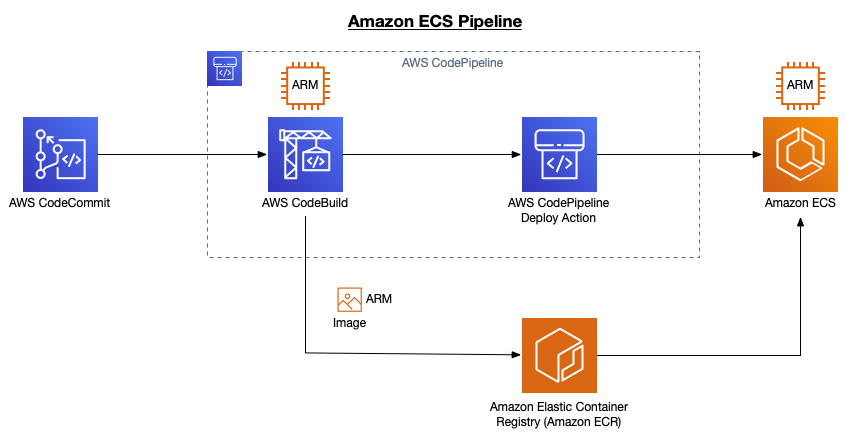
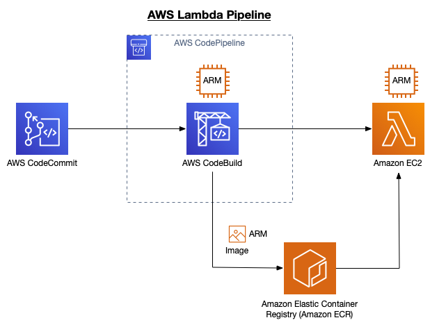
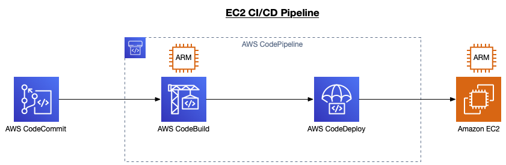

# AwsReinventXNT401
# .NET 6 on AWS Graviton Processors

This project demonstrates how to deploy a .NET 6 application with support for running on AWS Graviton processors (AWS' custom ARM processor).

## License
This library is licensed under the MIT-0 License. See the [LICENSE](LICENSE.TXT) file.

Additionally, this project installs the following software for the purposes of deploying and running the application:

* [Microsoft .NET](https://github.com/dotnet/runtime) is an open source developer platform, created by Microsoft is provided under the MIT License.
* [Entity Framework Core](https://github.com/dotnet/efcore) is a modern object-database mapper for .NET.

## Table of Contents
- [.NET 6 on AWS Graviton Processors](#net-6-on-aws-graviton-processors)
  - [License](#license)
  - [Table of Contents](#table-of-contents)
  - [Overview](#overview)
  - [Project Structure](#project-structure)
  - [Running the Code](#running-the-code)
  - [CI/CD Pipelines](#cicd-pipelines)
    - [Amazon ECS w/EC2 Launch Type](#amazon-ecs-wec2-launch-type)
    - [AWS Lambda](#aws-lambda)
    - [Amazon EC2](#amazon-ec2)

## Overview

This project provides a sample solution with two projects, Lambda Function, and WebApi, and the CloudFormation templates needed to deploy the infrastructure where these workloads are hosted. These projects are used to deploy to various compute services (EC2, ECS using EC2 Launch Type, and Lambda). The projects are fairly basic, to keep the focus on what it takes to support both provisioning ARM resources and running on ARM.

* **LambdaFunction** - Lambda function that returns environment information as well as weather data from an in memory Entity Framework (EF) database and adds encrypts the payload to simulate a CPU bound activity and artifically add load to each call.
* **WebApi** - ASP.NET 6 Web API that returns environment information as well as weather data from an in memory Entity Framework (EF) database and adds encrypts the payload to simulate a CPU bound activity and artifically add load to each call.

## Project Structure

This project follows the [src project structure](https://docs.microsoft.com/en-us/dotnet/core/porting/project-structure). In other words, this:
```
├─ infra
│  └─ network.yml
│  └─ cicd-*.yml
├─ LambdaFunction
│  └─ ...
├─ WebApi
│  └─ ...
├─ buildspec-*.yml
```

* **infra** folder contains the CloudFormation templates necessary to deploy the infrastructure. The folder contains a *network.yml* file that deploys a VPC. Files with the "cicd-" prefix deploy the AWS Code* resources (e.g., CodePipeline, CodeBuild) used as part of the pipeline. There is a x86 and an ARM pipeline deployed by each template.
* **LambdaFunction** folder contains the .NET 6 Lambda project. Because .NET 6 support is not one of the predefined Lambda runtimes, a custom Lambda runtime Docker image was created using the [aws-lambda-dotnet](https://github.com/aws/aws-lambda-dotnet) GitHub project, and is referenced by this project.
* **WebApi** folder contains the ASP.NET 6 Web API project. This project is deployed to EC2 as well as ECS.
 
## Running the Code
The code was developed using .NET 6. Follow the below steps to deploy the example to your own AWS account. Because AWS Lambda has not released support for .NET 6 at the time of this writing, you will not be able to deploy the Lambda function. Keep an eye on this repo. As support for .NET 6 on Lambda, and AWS CodePipeline support for ARM ECS Fargate Task Definitions are released, this repo will be updated.

1. Clone source code repository
   ```
   git clone git@github.com:Kirkaiya/reInvent-XNT303.git
   cd reInvent-XNT303
   ```
2. Deploy ECR repository
    ```
    aws cloudformation deploy --stack-name arm-demo-repo --template-file infra/codecommit-repo.yml --parameter-overrides ArtifactS3BucketName=<S3 bucket name> --region us-west-2
    ```
3. Push source code to AWS ECR repository. For information on how to setup your git client to connect to your ECR repository see []().
   ```
   git remote add ecr <Your Repo URL>
   git push ecr
   ```
4. Deploy Network. Make note of the output values displayed from the describe-stacks AWS CLI call.
    ```
    aws cloudformation deploy --stack-name arm-demo-network --template-file infra/network.yml --region us-west-2
    aws cloudformation describe-stacks --stack-name arm-demo-network --query Stacks[0].Outputs[*] --region us-west-2
    ```
5. Deploy CI/CD pipeline(s). Pick whichever pipeline(s) you want to deploy from the *infra* folder. Use the output values from the network stack deployed earlier to provide networking information. In this example, the ECS with EC2 launch type pipeline is deployed.
   ```
   aws cloudformation deploy --stack-name <Stack Name> --template-file infra/cicd-ecs-ec2.yml --parameter-overrides VpcId=<Vpc output value> SubnetId1=<PubSubnetAz1 output value> SubnetId2=<PubSubnetAz2 output value> ArtifactS3BucketName=<S3 bucket name> --capabilities CAPABILITY_NAMED_IAM --region us-west-2
   ``` 

## CI/CD Pipelines
There are CI/CD pipelies that deploy the application to various compute services (e.g., Lambda, ECS). The purpose of this project is to demonstrate the changes needed to provision ARM resources. The CI/CD pipelines have been kept as simple as possible so as not to detract from this main goal. For example, features such as blue/green deployments are not used.

### Amazon ECS w/EC2 Launch Type


This depicts the CI/CD pipeline for the ECS with EC2 launch type. The CloudFormation template file is `infra/cicd-ecs-ec2.yml`. Because this is an EC2 launch type, it is the InstanceType property of the AWS::AutoScaling::LaunchConfiguration CloudFormation resources that determine whether an x86 or ARM instance is used.

The Image property of the AWS::CodeBuild::Project project is used to set whether an x86 or ARM container image is used by CodeBuild when executing. See the [Docker images provided by CodeBuild](https://docs.aws.amazon.com/codebuild/latest/userguide/build-env-ref-available.html) page for the latest.

### AWS Lambda


This depicts the CI/CD pipeline for the Lambda function. Because AWS Lambda has not released support for .NET 6 at the time of this writing, you will not be able to deploy the Lambda function. It is the Architectures property of the AWS::Serverless::Function resource in the serverless.yml file that determines whether an x86 or ARM instance is used.

The Image property of the AWS::CodeBuild::Project project is used to set whether an x86 or ARM container image is used by CodeBuild when executing. See the [Docker images provided by CodeBuild](https://docs.aws.amazon.com/codebuild/latest/userguide/build-env-ref-available.html) page for the latest.

### Amazon EC2


This depicts the CI/CD pipeline when deploying to an EC2 instance. The CloudFormation template file is `infra/cicd-ec2.yml`. You will need to provision an EC2 instance and install .NET 6 on it, and tag it with the `reinvent-arm-demo` tag. The AWS CodeDeploy deployment group deploys the code to any EC2 instance with that tag.

The Image property of the AWS::CodeBuild::Project project is used to set whether an x86 or ARM container image is used by CodeBuild when executing. See the [Docker images provided by CodeBuild](https://docs.aws.amazon.com/codebuild/latest/userguide/build-env-ref-available.html) page for the latest.
